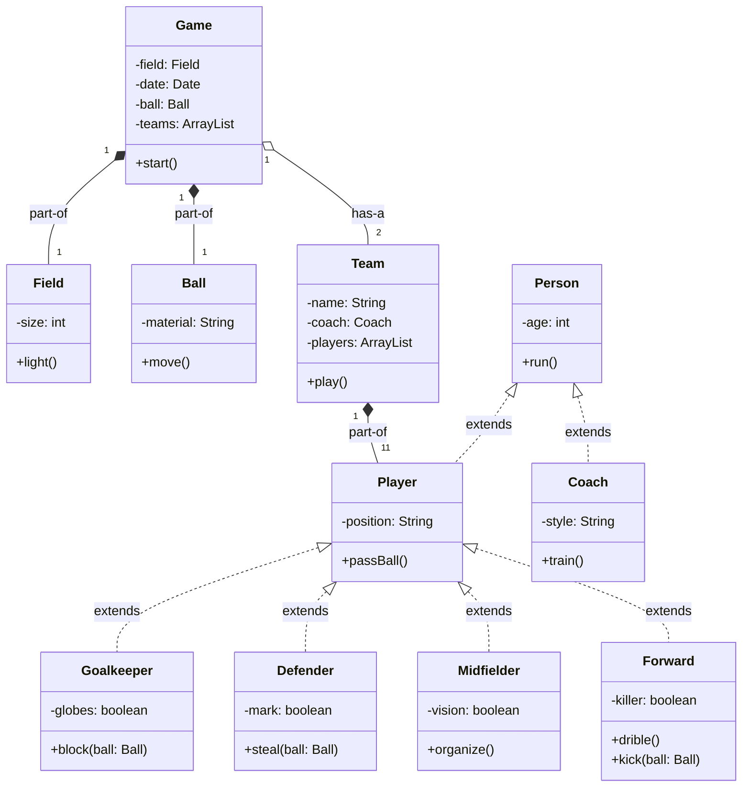

# Goal
* Practice git commands and branching strategy
* Read class diagrams
* Review inheritance concepts
* Review composition/agregation/association relationship
* Teamwork

# Class diagram

# Implementation
1. Create repository using this template to group git account
2. Check Game Class diagram and current implementation to identify what is pending to do
3. Assign every issue to a group member
4. Create a branch for each issue
5. Clone repository in local environment
6. Check out to corresponding branch
7. Code the change described in issue
8. Push from your local environment to your repository
9. Create a pull request from member branch to master branch
10. Resolve conflicts(if apply)
11. Merge 
12. Review if issue is closed
